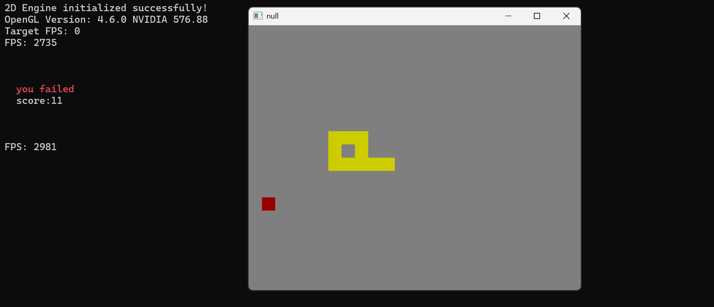

# easyEngine

一个基于 OpenGL 和 C++17 的轻量级 2D 游戏引擎，包含贪吃蛇游戏示例。

## 项目概述

这是一个模块化的 2D 游戏引擎，提供了渲染、输入处理、精灵管理、纹理管理等核心功能。引擎使用现代 C++ 编写，采用面向对象设计，易于扩展和使用。

目前是开发阶段，许多功能不完整也不完善。

## 功能特性

### 特性
- **跨平台支持**：基于 GLFW 和 OpenGL，支持 Windows、Linux、macOS
- **现代 C++**：使用 C++17 标准，包含智能指针、lambda 表达式等现代特性
- **帧率控制**：可配置的帧率限制，确保游戏运行一致性（实验性）
- **2D 精灵渲染**：支持位置、缩放、旋转和颜色调整
- **纹理管理**：支持从文件加载纹理或程序生成纹理
- **基本图形绘制**：矩形、线条、圆形等基本图形绘制
- **批处理渲染**：优化的渲染批处理系统
- **相机系统**：2D 相机支持平移、缩放和旋转
- **键盘输入**：实时键盘状态检测
- **鼠标输入**：鼠标位置和按钮状态获取
- **回调系统**：灵活的事件回调机制

### 示例
- **贪吃蛇游戏**：完整的贪吃蛇实现，展示部分引擎功能  


## 项目结构
```
game/
├── engin/                          # 引擎核心代码
│   ├── Application.hpp/cpp         # 应用管理和游戏循环
│   ├── 2d/                         # 2D 渲染模块
│   │   ├── Renderer2d.hpp/cpp      # 2D 渲染器
│   │   ├── Sprite.hpp/cpp          # 精灵类
│   │   ├── Texture2d.hpp/cpp       # 纹理管理
│   │   ├── Camera2d.hpp/cpp        # 2D 相机
│   │   ├── Vector2.hpp             # 2D 向量数学
│   │   └── Rect.hpp                # 矩形和碰撞检测
├── snake.cpp                       # 贪吃蛇游戏示例
├── CMakeLists.txt                  # 构建配置
└── assets/                         # 资源文件
    └── shaders/                    # GLSL 着色器
```

## 目前不足
- 无法加载图片作为纹理
- 帧率控制存在严重设计缺陷
- ...